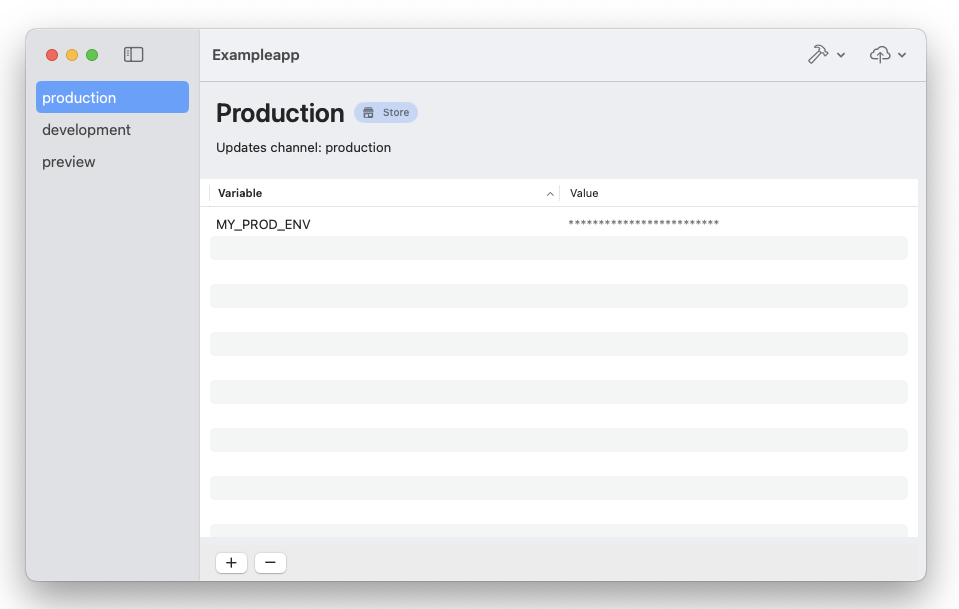

# Zynk

Zynk is a lightweight macOS application with the whole purpose of making managing environment variables in Expo apps much easier. You can handle environment variables, trigger EAS builds, and updates directly from the app without having to open the terminal and worry about the environment variables you are using for your OTA updates.

## Requirements

- EAS CLI installed
- Mac

## Installation

You can download Zynk.pkg from the [releases page](https://github.com/henrypl/zynk/releases).

## Usage

Make sure you have EAS CLI installed, when you first open the app, you will be prompted to input the path to the EAS CLI. After you've done that, you can open a project.

The app will automatically read the profiles from `eas.json` and  the app name from `app.json` and display them in the sidebar.